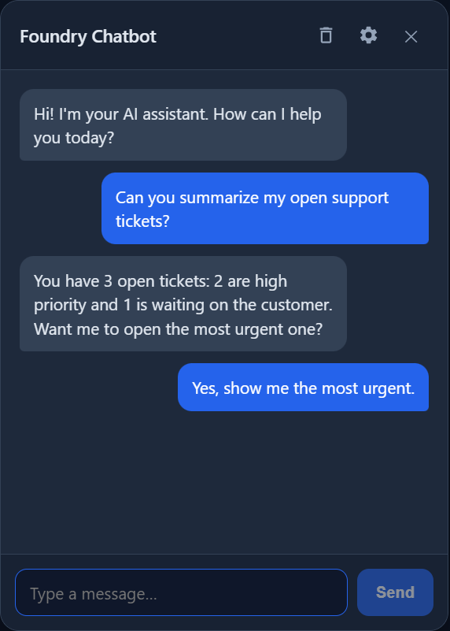

# Foundry Chatbot (ChatApp)

[](https://github.com/congiuluc/foundry-chatbot-test/actions/workflows/ci.yml)
[](https://github.com/congiuluc/foundry-chatbot-test/actions/workflows/pages.yml)
[](LICENSE)
[](https://dotnet.microsoft.com/)

A minimal **.NET 10** web application that lets users chat with an AI assistant powered by
**Microsoft Foundry** through the **Microsoft Agent Framework**. The backend talks either
directly to a deployed model or to an existing Foundry agent, streams responses to a
lightweight HTML/JS UI, and is fully configured through environment variables.

The chat experience is also packaged as a **zero-dependency embeddable widget** that can be
dropped onto any website with a single `<script>` tag.

---

## Table of contents

- [Features](#features)
- [Architecture](#architecture)
- [Quick start](#quick-start)
- [Configuration](#configuration)
- [Running locally](#running-locally)
- [Deployment](#deployment)
- [Embeddable widget](#embeddable-widget)
- [Documentation site](#documentation-site)
- [Contributing](#contributing)
- [License](#license)

---

## Features

- **ASP.NET Core minimal API** (no Blazor, no MVC) serving a static chat page from `wwwroot`.
- **Two backend modes**, selected by the `AI_MODE` environment variable:
  - `model` — chat completions against an Azure OpenAI / Foundry model deployment.
  - `agent` — an existing agent hosted on Microsoft Foundry.
- **Flexible authentication**: uses an API key when `AZURE_OPENAI_API_KEY` is set; otherwise
  falls back to **managed identity** (`DefaultAzureCredential`, honoring `AZURE_CLIENT_ID`
  for a user-assigned identity).
- **Streamed responses** (token-by-token) over Server-Sent Events.
- **Light / dark / system theme toggle** in the chat widget and the demo page.
- **Production-ready plumbing**: Serilog logging (console + rolling file), Swagger UI,
  health checks, response compression, and consistent JSON error handling.
- **Containerized** and deployable to Azure Container Apps via the included scripts, or
  pulled from Docker Hub through the automated release workflow.
- **Embeddable widget**: a single self-contained `chatbot-widget.js` with no runtime
  dependencies, fully themeable through `data-*` attributes.

## Architecture

```
src/ChatApp/
├── Program.cs              # App startup, DI, middleware, endpoint mapping
├── Endpoints/              # Minimal API endpoints (chat, health)
├── Services/               # Chat agent providers and credential factory
├── Middleware/             # Centralized error handling
├── Models/                 # Request/response DTOs
├── Configuration/          # Strongly-typed options bound from env vars
├── wwwroot/                # Static chat page + built widget bundle
└── widget/                 # TypeScript sources for the embeddable widget

docs/                       # GitHub Pages site (widget reference & examples)
scripts/                    # PowerShell build/deploy helpers
```

At runtime the app selects a chat provider based on `AI_MODE`, resolves credentials
(API key or managed identity), and exposes a streaming chat endpoint consumed by both the
bundled chat page and the embeddable widget.

## Quick start

Prerequisites: [.NET 10 SDK](https://dotnet.microsoft.com/), and (for deployment) the
[Azure CLI](https://learn.microsoft.com/cli/azure/) with the `containerapp` extension.

```powershell
git clone https://github.com/congiuluc/foundry-chatbot-test.git
cd foundry-chatbot-test
dotnet restore src/ChatApp/ChatApp.csproj
dotnet build src/ChatApp/ChatApp.csproj -c Release
```

## Configuration

All configuration is supplied through environment variables:

| Variable | Mode | Description |
|----------|------|-------------|
| `AI_MODE` | both | `model` (default) or `agent`. |
| `AZURE_OPENAI_ENDPOINT` | model | Azure OpenAI / Foundry models endpoint. |
| `AZURE_OPENAI_DEPLOYMENT_NAME` | model | Model deployment name. |
| `AZURE_OPENAI_API_KEY` | model | Optional. When omitted, managed identity is used. |
| `AZURE_FOUNDRY_PROJECT_ENDPOINT` | agent | Foundry project endpoint. |
| `AZURE_FOUNDRY_AGENT_ID` | agent | Name of the existing Foundry agent. |
| `AZURE_FOUNDRY_AGENT_VERSION` | agent | Optional agent version (latest when omitted). |
| `AZURE_CLIENT_ID` | both | Optional user-assigned managed identity client id. |
| `CHAT_SYSTEM_PROMPT` | model | Optional system instructions. |
| `CHAT_AGENT_NAME` | model | Optional agent display name. |

## Running locally

```powershell
$env:AI_MODE = "model"
$env:AZURE_OPENAI_ENDPOINT = "https://<your-resource>.openai.azure.com/"
$env:AZURE_OPENAI_DEPLOYMENT_NAME = "gpt-4o-mini"
# Leave AZURE_OPENAI_API_KEY unset to use your `az login` / managed identity.
dotnet run --project src/ChatApp/ChatApp.csproj
```

Then open the printed URL. Swagger is available at `/swagger` and the health check at
`/healthz`.

## Deployment

### Build & push the container image

```powershell
./scripts/build-and-push.ps1 -RegistryName <acrName> -Tag v1
```

### Deploy to Azure Container Apps

```powershell
./scripts/deploy-containerapp.ps1 `
    -ResourceGroup rg-chat `
    -EnvironmentName cae-chat `
    -AppName chatapp `
    -RegistryName <acrName> `
    -Tag v1 `
    -EnvVars @{
        AI_MODE = "model"
        AZURE_OPENAI_ENDPOINT = "https://<your-resource>.openai.azure.com/"
        AZURE_OPENAI_DEPLOYMENT_NAME = "gpt-4o-mini"
    }
```

The script enables a system-assigned managed identity and grants it `AcrPull`. Remember to
also grant that identity access to your Foundry resource (e.g. **Azure AI User** or
**Cognitive Services OpenAI User**).

### Published container image

Tagging a release (`v*.*.*`) triggers the [release workflow](.github/workflows/release.yml),
which builds the image and pushes it to Docker Hub as `<docker-hub-user>/chatapp`. Each
release is tagged with its version plus a channel tag derived from the Git tag:

| Git tag example | Channel tag | GitHub release |
|-----------------|-------------|----------------|
| `v1.2.3` | `latest` | stable |
| `v1.2.3-prerelease` | `prerelease` | pre-release |
| `v1.2.3-dev` | `dev` | pre-release |

The workflow requires the `DOCKERHUB_USERNAME` and `DOCKERHUB_TOKEN` repository secrets.
Pull and run the published image with:

```powershell
docker pull <docker-hub-user>/chatapp:latest
docker run -p 8080:8080 `
    -e AI_MODE=model `
    -e AZURE_OPENAI_ENDPOINT="https://<your-resource>.openai.azure.com/" `
    -e AZURE_OPENAI_DEPLOYMENT_NAME="gpt-4o-mini" `
    <docker-hub-user>/chatapp:latest
```

## Embeddable widget

The chat UI is also shipped as a single, self-contained script (`chatbot-widget.js`, built
from the TypeScript sources in `src/ChatApp/widget`). Drop it on any website to render a
floating launcher and chat panel:

<p align="center">
  
</p>

```html
<script
    src="https://your-app.example.com/chatbot-widget.js"
    data-title="Support"
    data-accent="#2563eb"
    defer></script>
```

All behaviour and theming is controlled through `data-*` attributes on the script tag:

| Attribute | Default | Description |
|-----------|---------|-------------|
| `data-api-base` | script origin | Backend base URL the widget calls. |
| `data-title` | `Chatbot` | Header title text. |
| `data-accent` | `#2563eb` | Accent colour (launcher and primary actions). |
| `data-icon` | — | URL of a custom launcher icon image (`https:`, `data:image/`, or `/path`). |
| `data-panel` | `#1e293b` | Chat panel background colour. |
| `data-user-bubble` | accent | Background colour of user (outgoing) bubbles. |
| `data-bot-bubble` | `#334155` | Background colour of bot (incoming) bubbles. |
| `data-text` | `#e2e8f0` | Primary text colour inside the panel. |
| `data-position` | `bottom-right` | Anchor corner: `bottom-right` or `bottom-left`. |
| `data-allow-settings` | `true` | Set to `false` to hide the in-panel settings UI. |
| `data-greeting` | `Ask me anything to get started.` | Opening assistant message. |
| `data-storage-key` | derived | LocalStorage key for persisting the conversation. |
| `data-debug` | `false` | Set to `true` to enable verbose console logging. |

Colour values accept hex (`#0f172a`), `rgb()/rgba()`, `hsl()/hsla()` or CSS named colours;
invalid values are ignored and fall back to the defaults.

The widget also includes an interactive light / dark / system theme toggle (a header icon
button plus a selector in the settings panel); the chosen theme is remembered per session.

### Rebuilding the widget bundle

```powershell
cd src/ChatApp/widget
npm install
npm run build      # outputs ../wwwroot/chatbot-widget.js
```

## Documentation site

A full widget reference with live, copyable examples is published as a
[GitHub Pages site](https://congiuluc.github.io/foundry-chatbot-test/) (sources in `docs/`).
It is deployed automatically by the [Pages workflow](.github/workflows/pages.yml) whenever
the `docs/` directory changes on `main`.

## Contributing

Contributions are welcome! Please read [CONTRIBUTING.md](CONTRIBUTING.md) for the
development setup and conventions, and note our [Code of Conduct](CODE_OF_CONDUCT.md).
Changes are tracked in [CHANGELOG.md](CHANGELOG.md). To report a security issue, follow
[SECURITY.md](SECURITY.md) instead of opening a public issue.

## License

Licensed under the MIT License. See [LICENSE](LICENSE) for details.
